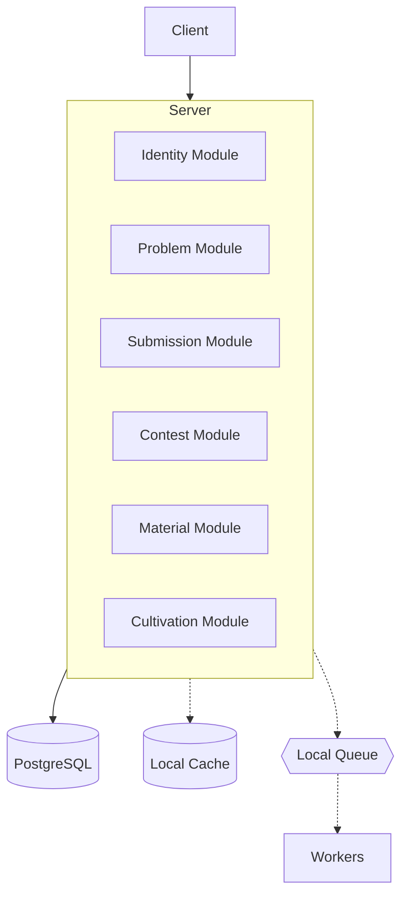

# Judgify


[](LICENSE)
[](https://goreportcard.com/report/github.com/huynhanx03/Judgify/api)
[](https://github.com/huynhanx03/Judgify/stargazers)

Judgify is an open-source online judge and competitive programming platform for algorithm practice, code submissions, automated judging, contests, and learning materials. It combines classic programming problem solving with a Cultivation (Xianxia) gamification system, where learners can grow stats, discover elemental affinities, collect traits, climb rankings, and break through cultivation realms as they solve coding challenges.

## Features

- Practice algorithmic problems with an online judge workflow
- Submit code and receive automated judging results
- Join programming contests with standings and rating updates
- Learn through materials, problem sets, and guided practice
- Track user profiles, rankings, and submission history
- Progress through a Cultivation system with stats, ranks, elements, rarities, traits, and gacha
- Manage users, roles, permissions, problems, contests, and game content from the admin dashboard

## Tech Stack

* Frontend: Next.js 16, React 19, TypeScript, Tailwind CSS v4
* Backend: Go 1.25+, Gin Framework
* Database & ORM: PostgreSQL, Ent
* Caching & Queue: Local
* Infrastructure: Docker, Make

## System Architecture

Judgify uses a modular monolith architecture. Core domains stay inside one deployable backend while remaining separated by responsibility, making the project easier to develop, test, and run locally.



## Quick Start

```bash
make docker-up
make migrate-apply
make seed
make run-api
make run-website
```

## Future Roadmap

- [ ] Event-driven local cache synchronization
- [ ] Frontend performance and UI/UX improvements
