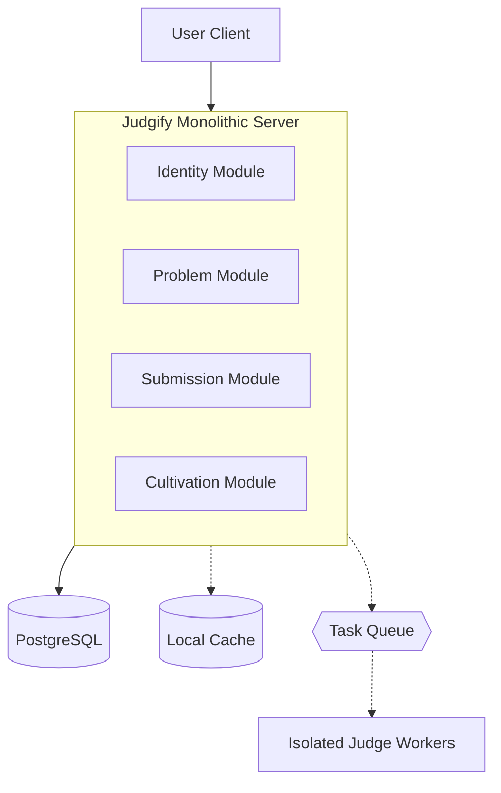

# Judgify

[](https://github.com/huynhanx03/Judgify/actions/workflows/ci.yml)
[](LICENSE)

An Online Judge powered by a Cultivation (Xianxia) gamification system to improve the learning experience.

Judgify goes beyond a standard code judging platform. By merging competitive programming with an RPG-like progression system, users can cultivate their stats, discover elemental affinities, and breakthrough cultivation realms as they solve algorithmic challenges.

## Tech Stack

* Frontend: Next.js 16, React 19, TypeScript, Tailwind CSS v4
* Backend: Go 1.25+, Gin Framework
* Database & ORM: PostgreSQL, Ent
* Caching & Queue: Local Cache
* Infrastructure: Docker, Make

## System Architecture

Judgify is constructed as a high-performance Monolithic application, designed to effortlessly handle features like rate-limiting and robust data caching internally without the overhead of microservices.



## Setup Guide

We use Make commands to streamline the setup and installation process.


### 1. Start Infrastructure

Bring up the database and cache containers:

```bash
make docker-up
```

### 2. Prepare the Database

Apply schema migrations and seed the initial data:

```bash
make migrate-apply
make seed
```

### 3. Run the Backend (API)

The backend API server typically runs on port 8080:

```bash
make run-api
```

### 4. Run the Web Interface

Boot up the local development frontend server:

```bash
make run-website
```

## Useful Commands

| Command | Description |
|---|---|
| `make run-api` | Starts the Go API backend. |
| `make run-website` | Starts the local frontend development server. |
| `make docker-up` / `docker-down` | Manage backend infrastructure containers. |
| `make generate` | Regenerates Ent schemas and API bindings. |
| `make migrate-diff name=...` | Generates a new migration script based on schema changes. |
| `make migrate-apply` | Applies pending migrations to the local database. |
| `make seed` | Injects predefined seed data for testing. |

## Future Roadmap

- [ ] Daily Missions: Implement daily coding tasks (e.g., 3 challenges a day) to encourage consistent practice and reward users with cultivation materials.
- [ ] Local Cache Synchronization: Implement an event-driven syncing mechanism to keep the local cache seamlessly consistent with database updates in real-time.
- [ ] Frontend Optimization: Revamp the web interface for higher performance, smoother animations, and an optimized UI/UX design.
