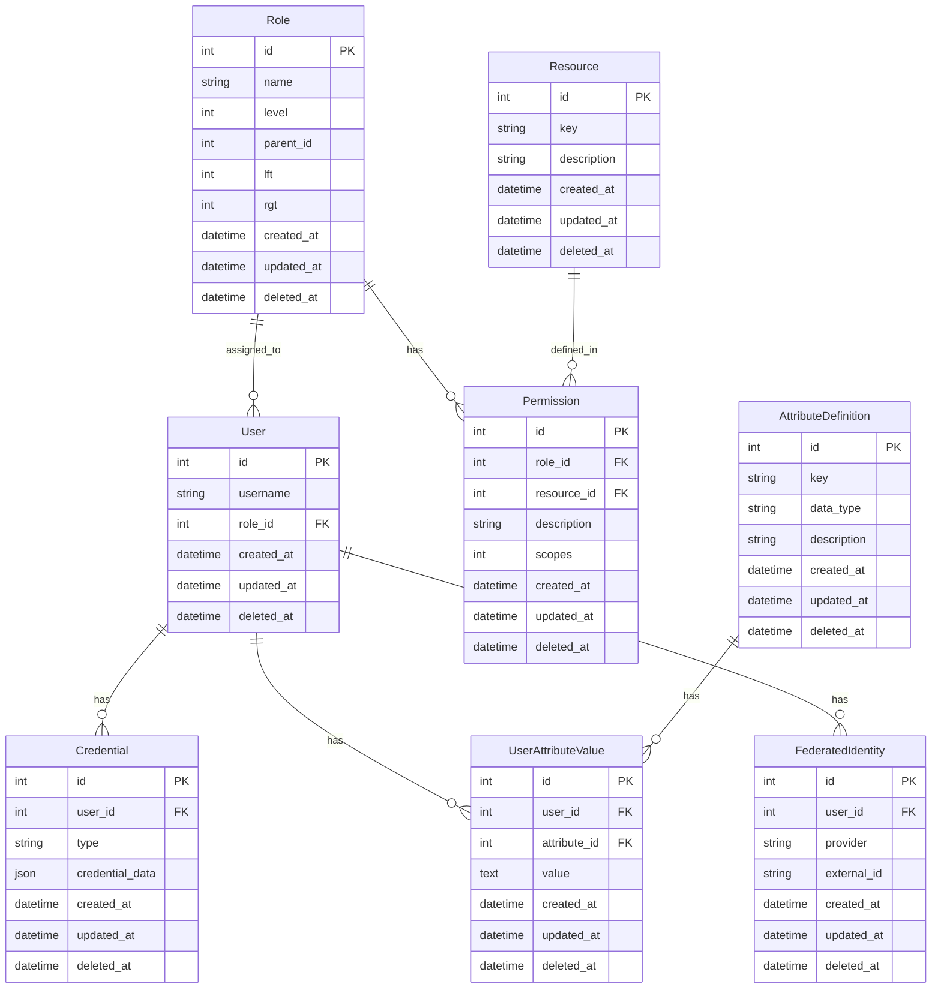

# Entity Relationship Diagram (ERD)

This diagram represents the current database schema managed by Ent.

```mermaid
erDiagram
    User ||--o{ Credential : "has"
    User ||--o{ UserAttributeValue : "has"
    User ||--o{ FederatedIdentity : "has"
    Role ||--o{ User : "assigned_to"
    Role ||--o{ Permission : "has"
    Resource ||--o{ Permission : "defined_in"
    AttributeDefinition ||--o{ UserAttributeValue : "has"

    User {
        int id PK
        string username
        int role_id FK
        datetime created_at
        datetime updated_at
        datetime deleted_at
    }

    Role {
        int id PK
        string name
        int level
        int parent_id
        int lft
        int rgt
        datetime created_at
        datetime updated_at
        datetime deleted_at
    }

    Credential {
        int id PK
        int user_id FK
        string type
        json credential_data
        datetime created_at
        datetime updated_at
        datetime deleted_at
    }

    Permission {
        int id PK
        int role_id FK
        int resource_id FK
        string description
        int scopes
        datetime created_at
        datetime updated_at
        datetime deleted_at
    }

    Resource {
        int id PK
        string key
        string description
        datetime created_at
        datetime updated_at
        datetime deleted_at
    }

    AttributeDefinition {
        int id PK
        string key
        string data_type
        string description
        datetime created_at
        datetime updated_at
        datetime deleted_at
    }

    UserAttributeValue {
        int id PK
        int user_id FK
        int attribute_id FK
        text value
        datetime created_at
        datetime updated_at
        datetime deleted_at
    }

    FederatedIdentity {
        int id PK
        int user_id FK
        string provider
        string external_id
        datetime created_at
        datetime updated_at
        datetime deleted_at
    }
```
